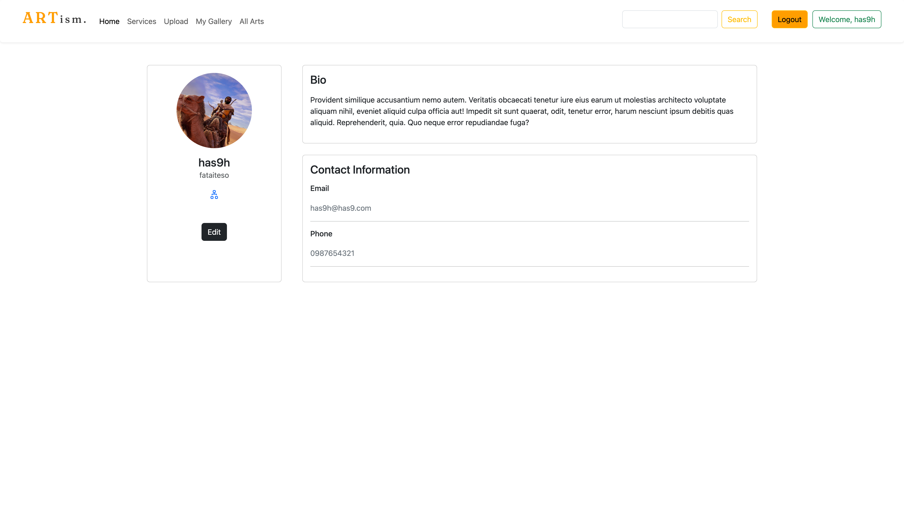

# Art Affiliate Martketplace

### Course: Web Applications & Internet

### Semester: Spring 2023

### Section: 02

### Group 5

### Team Members:

- [1911116](https://github.com/ishraqfatin) - Fatin Ishraq Ahammed
- [1910018](https://github.com/Aronib) - Mst Aroni Begum
- [2030486](https://github.com/hasin-eshrak) - Hasin Eshrak

## Demo Video:

## Project Description and Scopes:

The website is focused on affiliate marketing and will cater to independent artists who are looking to gain exposure in the market place by selling their arts and crafts.
 
Artism is a platform that gives artists to showcase their arts. It also gives them the freedom to sell their arts and crafts individually. And collaborate with other artists.

## Tools used:

- PHP
- Bootstrap
- CSS
- Javascript

## Screenshots of the pages:

<!-- If the images are not visible, please navigate to [/screenshots](https://github.com/RHShihab/Swimming-pool-slot-booking-system) folder -->

### Login/Registration Pages:

Log in:

Register:

### Guest user

Home page:

Services Page:

About Us Page:

### Registered user

User Dashboard:

User Gallery:

### Admin

Dashboard:

